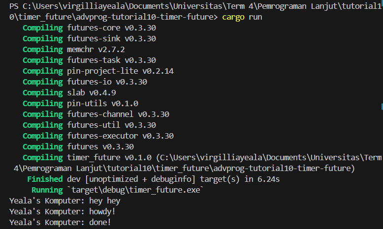
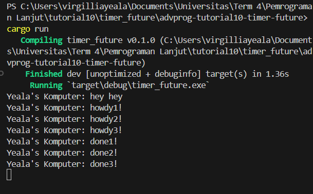

# advprog-tutorial10-timer-future
##### Nama : Virgillia Yeala Prabowo
##### Kelas : AdvProg-a
##### NPM : 2206829856*

Berdasarkan pengamatan, fungsi async dijalankan di luar fungsi utama yang memanggilnya. Ini berarti bahwa "hey hey" bisa tercetak sebelum "howdy!" dan "done!" karena "hey hey" dipanggil sebelum fungsi async menyelesaikan eksekusinya. Dalam kode yang diberikan : 
```rust
fn main() {
    let (executor, spawner) = new_executor_and_spawner();

    // Spawn a task to print before and after waiting on a timer.
    spawner.spawn(async {
        println!("Yeala's Komputer: howdy!");
        // Wait for our timer future to complete after two seconds.
        TimerFuture::new(Duration::new(2, 0)).await;
        println!("Yeala's Komputer: done!");
    });

    println!("Yeala's Komputer: hey hey");

    // Drop the spawner so that our executor knows it is finished and won't
    // receive more incoming tasks to run.
    drop(spawner);

    // Run the executor until the task queue is empty.
    // This will print "howdy!", pause, and then print "done!".
    executor.run();
}
```
Dari kode di atas, terlihat bahwa println!("Yeala's Komputer: hey hey"); dipanggil sebelum future selesai dieksekusi. Ini berarti bahwa "hey hey" dapat dicetak sebelum "howdy!" dan "done!". Hasil output bisa saja menjadi:



Ini disebabkan oleh fakta bahwa "hey hey" dipanggil sebelum future selesai dieksekusi. Dengan kata lain, meskipun "howdy!" adalah bagian dari tugas async, "hey hey" dicetak terlebih dahulu karena dipanggil secara langsung dari fungsi main(), sementara tugas async menunggu hasil dari future sebelum melanjutkan eksekusi.

```rust
fn main() {
    let (executor, spawner) = new_executor_and_spawner();

    // Spawn a task to print before and after waiting on a timer.
    spawner.spawn(async {
        println!("Yeala's Komputer: howdy1!");
        // Wait for our timer future to complete after two seconds.
        TimerFuture::new(Duration::new(2, 0)).await;
        println!("Yeala's Komputer: done1!");
    });

    spawner.spawn(async {
        println!("Yeala's Komputer: howdy2!");
        // Wait for our timer future to complete after two seconds.
        TimerFuture::new(Duration::new(2, 0)).await;
        println!("Yeala's Komputer: done2!");
    });

    spawner.spawn(async {
        println!("Yeala's Komputer: howdy3!");
        // Wait for our timer future to complete after two seconds.
        TimerFuture::new(Duration::new(2, 0)).await;
        println!("Yeala's Komputer: done3!");
    });

    println!("Yeala's Komputer: hey hey");

    // Drop the spawner so that our executor knows it is finished and won't
    // receive more incoming tasks to run.
    // drop(spawner);

    // Run the executor until the task queue is empty.
    // This will print "howdy!", pause, and then print "done!".
    executor.run();
}
```
Dari hasil output yang dihasilkan, terlihat bahwa keberadaan beberapa spawner menyebabkan lebih banyak tugas yang dilakukan karena lebih banyak tugas yang ditambahkan ke antrian tugas yang dikelola oleh spawner. Setiap spawner.spawn(async { ... }) memulai sebuah tugas async yang mencetak pesan "howdyX!" dan "doneX!" setelah menunggu selama dua detik menggunakan TimerFuture::new(Duration::new(2, 0)).await;.

Namun, println!("Yeala's Komputer: hey hey"); dipanggil sebelum semua tugas async selesai dieksekusi. Ini berarti bahwa "hey hey" akan dicetak sebelum semua "howdy!" dan "done!" selesai.Output yang dihasilkan menjadi:



Dalam kode di atas, semua tugas async dieksekusi secara bergantian, menunggu dua detik sebelum mencetak "doneX!". Sehingga, output yang diharapkan adalah seperti yang telah diprediksi di atas. Program tidak akan pernah berhenti karena spawner masih aktif dan menunggu adanya tugas baru yang akan ditambahkan ke antrian tugas.